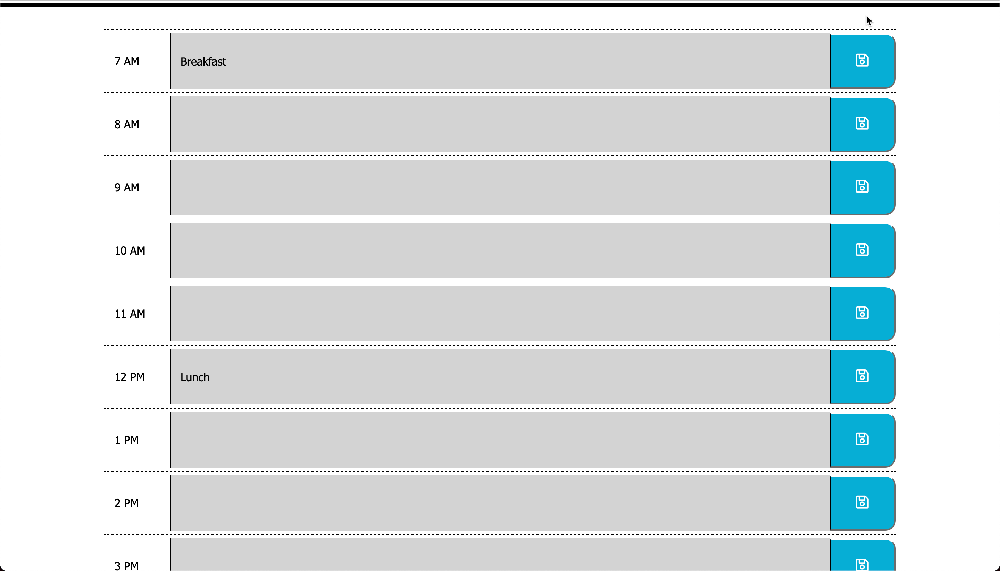

# daily-planner

## Description
 A simple calendar application that allows a user to save events for each hour of the day. This app will run in the browser and feature dynamically updated HTML and CSS powered by javaScript and jQuery.

## Usage
You can access the app here [https://avidrunner87.github.io/daily-planner/](https://avidrunner87.github.io/daily-planner/).

## User Story
**AS AN** employee with a busy schedule 
I **WANT** to add important events to a daily planner 
**SO THAT** I can manage my time effectively

### Acceptance Criteria
**GIVEN** I am using a daily planner to create a schedule

>WHEN I open the planner 
THEN the current day is displayed at the top of the calendar

>WHEN I scroll down 
THEN I am presented with timeblocks for standard business hours

>WHEN I view the timeblocks for that day 
THEN each timeblock is color coded to indicate whether it is in the past, present, or future

>WHEN I click into a timeblock 
THEN I can enter an event

>WHEN I click the save button for that timeblock 
THEN the text for that event is saved in local storage

>WHEN I refresh the page 
THEN the saved events persist

## Licenses

## Technologies

## Mock-up
The following picture shows the website appearance and capabilities:

 

## Installation
To fork this code to further improve the website, please follow these directions:

1. In Github fork the repository.
1. Clone the repository to your local computer.

_This assumes that you have setup your own SSH keys to connect with Github._

## References
[MDN Web Docs](https://developer.mozilla.org/en-US/docs/Web/HTML/Element) 
[W3 Schools](https://www.w3schools.com/) 
[jQuery](https://jquery.com) 
[jQueryUI](https://jqueryui.com)